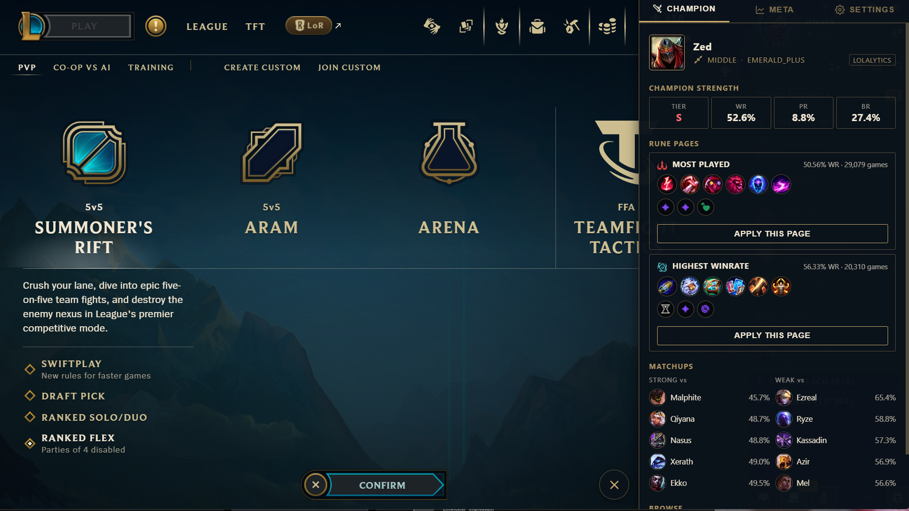
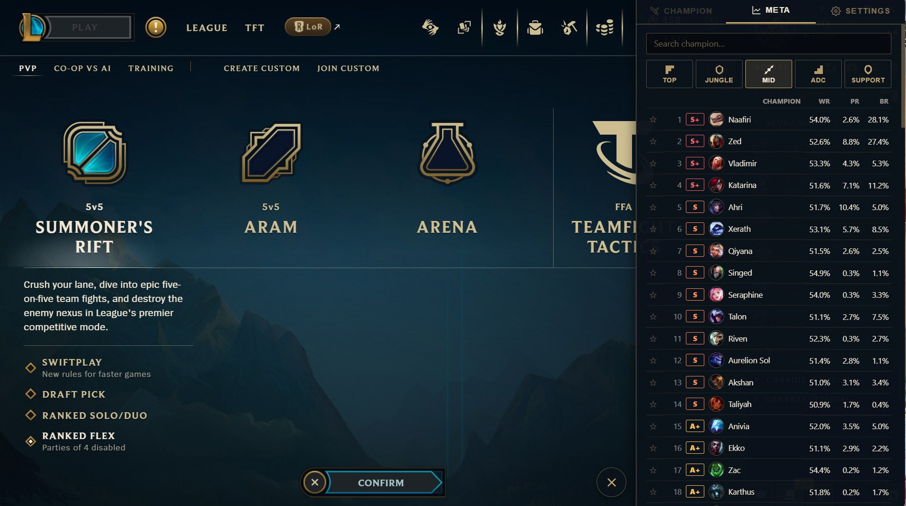

# league-lean

> A lean, opinionated Pengu Loader plugin that augments the League of Legends client with the things Riot didn't ship: live tier list, automatic rune & item-build import, embedded matchup analytics, and a one-click op.gg surface for every player you've ever queued with.

> **⚠ Not endorsed by Riot Games.** league-lean isn't created, endorsed, sponsored, or specifically approved by Riot Games. *Riot Games* and all associated properties are trademarks or registered trademarks of Riot Games, Inc. The plugin uses Riot's local LCU API, which is unsupported for third-party use; expect occasional patch-day breakage. **Korean accounts:** Riot's policy prohibits LCU plugins in the KR region — do not use this plugin there.

<p align="center">
  
  
</p>

---

## Table of contents

- [What it does](#what-it-does)
- [Screenshots](#screenshots)
- [Requirements](#requirements)
- [Installation](#installation)
  - [Quick install (Windows)](#quick-install-windows)
  - [Quick install (macOS — experimental)](#quick-install-macos--experimental)
  - [Manual / development install](#manual--development-install)
- [Usage](#usage)
  - [Sidebar](#sidebar)
  - [Champion tab](#champion-tab)
  - [Meta tab](#meta-tab)
  - [Settings tab](#settings-tab)
  - [Post-game overlay](#post-game-overlay)
- [Configuration](#configuration)
- [How it works](#how-it-works)
  - [Data sources](#data-sources)
  - [LCU endpoints used](#lcu-endpoints-used)
  - [Architecture](#architecture)
- [Updates](#updates)
- [Patch-day maintenance](#patch-day-maintenance)
- [Project structure](#project-structure)
- [Development](#development)
- [Roadmap](#roadmap)
- [Troubleshooting](#troubleshooting)
- [Contributing](#contributing)
- [License](#license)
- [Acknowledgements](#acknowledgements)

---

## What it does

| Category | Feature |
|---|---|
| **Champ select** | Auto-detect locked-in champion → switch sidebar focus instantly |
|  | Auto-apply rune page (most-played or highest-winrate, configurable) |
|  | Auto-apply complete item build (starter / boots / core / situational) into a custom in-game shop set |
|  | Auto lock-in (configurable grace delay) |
|  | One-click manual apply for either rune page |
| **Meta** | Live tier list per lane (Top / Jungle / Mid / ADC / Support) with WR / PR / BR |
|  | S+ → D color-coded tier badges, sortable by champion rank |
|  | Search-as-you-type by champion name |
|  | **Stars synced with Riot's preferred-picks** (the heart icons used for autofill protection) |
|  | Click any row → opens the full Champion view for that champion |
| **Champion** | Embedded panel with: tier, win rate, pick rate, ban rate |
|  | **Two rune pages side-by-side**: most-played (highest sample) vs. highest winrate |
|  | Strong vs / Weak vs matchup tables, with sample-size filtering |
|  | One-click deeplinks to Lolalytics, U.GG, METAsrc, Mobalytics, op.gg, ProBuilds |
| **Post-game** | Floating overlay with all 10 players: portrait, riot ID, champion, KDA |
|  | One-click op.gg button per player, region-aware |
|  | **Match history viewer** — last 20 games with expandable per-match detail |
|  | Your row highlighted across both views |
| **Queue** | Auto-accept queue (configurable grace delay) |
| **Aesthetic** | Hide overloaded UI: Loot, Clubs, Events, news widget |
|  | Performance mode — disable animated borders, splash transitions, particle effects |
| **Quality of life** | Bottom-right collapsible sidebar, slides in from the right |
|  | All toggles hot-apply (no client reload) |
|  | In-app update checker against the GitHub repo |

---

## Screenshots

### Champion tab — locked into Zed mid

The Champion tab auto-focuses when you lock in a champion in champ select. It pulls live meta data and shows you everything in one place: tier, win rate, both rune-page variants (with one-click apply), and matchup intelligence.

<p align="center"></p>

### Meta tab — full tier list per lane

Click any lane (Top, Jungle, Mid, ADC, Support) to swap the table. Search filters as you type. Stars sync with Riot's "preferred picks" system — toggling a star here updates the heart in Riot's collection page (and vice-versa).

<p align="center"></p>

---

## Requirements

- **League of Legends client** (current patch — see [patch-day maintenance](#patch-day-maintenance) for what to do when a patch reshuffles things).
- **[Pengu Loader](https://pengu.lol/) ≥ v1.1**, installed and activated.
- **Windows 10/11** is the primary target. macOS is supported via the experimental [pengu-mac](https://github.com/PenguLoader/pengu-mac).

The installer uses tools that already ship with the OS (`curl` + `Expand-Archive` on Windows, `curl` + `tar` on macOS). **No git, Node, or any other toolchain is required.** Updates after the first install happen via an in-app button, no scripts needed.

> **Region note.** Riot policy explicitly prohibits LCU plugins in **Korea**. Do not install or use this plugin if your account is in the KR region.

---

## Installation

### Quick install (Windows)

1. Install [Pengu Loader](https://pengu.lol/) and enable it.
2. In the Pengu UI, click **Open plugins folder**.
3. Download the installer script into that folder:
   - [`install-league-lean.bat`](https://raw.githubusercontent.com/Nicetyone/league-lean/main/install-league-lean.bat) (right-click → *Save link as*)
4. **Double-click** `install-league-lean.bat`. It downloads `main.zip` from GitHub, extracts via `Expand-Archive`, and stamps `version.js` with the latest commit's SHA + date.
5. Fully quit the League client (right-click the system-tray icon → *Quit*) and relaunch via Riot Client.

To **update later**, *don't* re-run the script — open the sidebar in the client → Settings → **Update now & reload**. The installer is bootstrap-only.

### Quick install (macOS — experimental)

```sh
cd "/Applications/League of Legends.app/Contents/LoL/plugins"
curl -O https://raw.githubusercontent.com/Nicetyone/league-lean/main/install-league-lean.sh
bash install-league-lean.sh
```

Note: macOS Pengu support is itself experimental ([pengu-mac](https://github.com/PenguLoader/pengu-mac)). Expect rougher edges than Windows.

### Manual / development install

If you want edits to live without re-cloning, symlink your local checkout into the plugins folder. (This is also where you'd start if you actually do want to use git — clone normally, then symlink.)

**Windows (admin PowerShell):**

```powershell
mklink /D "C:\Riot Games\League of Legends\plugins\league-lean" "C:\path\to\league-lean"
```

**macOS:**

```sh
ln -s "$PWD" "/Applications/League of Legends.app/Contents/LoL/plugins/league-lean"
```

Reload changes during development with **`Alt + Shift + R`** in the League client (DevTools-equivalent reload). No need to restart the client.

---

## Usage

### Sidebar

A small gold round button in the **bottom-right corner** of the client toggles the sidebar. The sidebar slides in from the right and contains three tabs: **Champion**, **Meta**, **Settings**.

- The sidebar mounts under `<html>` (not under any view-router subtree), so Riot's navigation never accidentally unmounts it.
- A `MutationObserver` re-attaches the panel if Riot's frontend ever wipes it.

### Champion tab

Available **inside champ select** (your locked-in pick) and **always available via Meta-tab click-through** (browse mode).

**Header**: champion portrait + name + lane icon + tier rank + meta source badge (lolalytics or u.gg).

**Champion strength**: TIER (color-coded letter, S+ red → D grey), WR, PR, BR — pulled from Lolalytics' `ep=counter` summary.

**Rune pages**: two cards rendered side-by-side from Lolalytics `summary.runes.pick` (most-played, highest sample) and `summary.runes.win` (highest winrate). Each card has actual rune icons (resolved via the bundled CDragon perk map), winrate, sample size, and an **Apply this page** button that POSTs to `/lol-perks/v1/pages` with proper LCU validation.

**Matchups**: top 5 favorable and 5 unfavorable lane matchups by enemy win rate. Filtered to ≥200-game samples to avoid tiny-sample noise.

**Browse**: 6 deeplink buttons (Lolalytics, U.GG, METAsrc, Mobalytics, op.gg, ProBuilds) — for sources that don't expose JSON APIs we can't import from, or for users who prefer the full site UX.

When you're in **browse mode** (clicked into a champion from Meta tab) and an actual champ-select session is live, a **"← Back to my pick"** banner appears at the top to snap you back to your real matchup.

### Meta tab

Live tier list, one lane at a time.

- **Lane tabs**: Top / Jungle / Mid / ADC / Support — Riot's actual position SVGs (utility maps to support).
- **Search**: type any substring, table filters live (80ms debounce).
- **Stars** (★) on the left of each row: synced with Riot's per-position favorites via `POST /lol-champ-select/v1/toggle-favorite/{championId}/{position}`. Toggling here updates the heart icon in Riot's collection page; Riot's hearts show up here. Per-lane: a champion starred for jungle won't appear starred when you flip to top.
- **Click any row** → opens that champion's full view in the Champion tab (browse mode).

Tier letters (S+ → D) are computed by percentile of in-lane rank, color-coded per metasrc convention.

### Settings tab

Toggles for every feature, plus meta source / tier preferences, plus update checker. See [Configuration](#configuration).

### Post-game overlay

Two surfaces, same renderer:

- **Auto-pop** — when the gameflow phase enters `WaitingForStats`, `PreEndOfGame`, or `EndOfGame`, an overlay appears at the top-center of the screen with all 10 players from `/lol-end-of-game/v1/eog-stats-block`. Each row: champion portrait, riot ID, champion name, KDA, **op.gg** button. Your row is highlighted with a gold border.
- **Manual** — *Settings tab → Open match history*. Pulls your last 20 games from `/lol-match-history/v1/products/lol/current-summoner/matches`. Click any match row to expand it into the full 10-player scoreboard with op.gg buttons.

The overlay auto-closes when you leave the post-game cluster; click the **×** in its header to dismiss any time.

---

## Configuration

All settings persist in Pengu's `DataStore` and **hot-apply** — no client reload needed.

### Toggles

| Setting | Default | Effect |
|---|---|---|
| `autoAccept` | `false` | Auto-accept queue when ready-check fires (600ms grace) |
| `autoLockIn` | `true` | Auto-lock-in your champion when your pick action becomes active |
| `autoApplyRunes` | `true` | Auto-apply a rune page when champion + position stabilises (1.2s debounce) |
| `autoApplyItems` | `true` | Auto-import a custom item set matching the runes |
| `postGameOpgg` | `true` | Show post-game overlay on match end |
| `homeCleanup` | `true` | CSS hide Loot, Clubs, Events tabs and the news widget |
| `performanceMode` | `false` | Disable animations / particles / splash transitions |

### Selects

| Setting | Default | Options |
|---|---|---|
| `autoApplyRunePage` | `pick` | `pick` (most-played), `win` (highest winrate) |
| `metaSource` | `lolalytics` | `lolalytics` (100% sample), `ugg` (Riot partner) |
| `metaTier` | `platinum_plus` | `all`, `platinum_plus`, `emerald_plus`, `diamond_plus`, `master_plus`, `challenger` |

---

## How it works

### Data sources

| Source | Used for | Notes |
|---|---|---|
| **Lolalytics** `https://a1.lolalytics.com/mega/` | Runes, item builds, tier list, counters | 100% ranked sample. Endpoint family: `ep=rune \| build-itemset \| tier \| counter`. The `c=` parameter is the **champion slug** (`aatrox`, `drmundo`), not the numeric id. |
| **U.GG** `https://stats2.u.gg/lol/` | Rune fallback when Lolalytics fails | Riot-approved partner. `statsVersion` and `overviewVersion` are bumped per-patch by U.GG (currently `1.5` / `1.5.0`). |
| **Community Dragon** `raw.communitydragon.org` | Initial source for the **bundled** perk map (`lib/perk-data.js`). Not hit at runtime. |
| **LCU local assets** `/lol-game-data/assets/v1/` | Champion portraits, perk icons, stat-shard icons | Same-origin to the renderer — no CSP, no CORS. |
| **GitHub REST API** `https://api.github.com/repos/...` | Update checker | Unauthenticated read, 60 req/hour per IP. |

### LCU endpoints used

For Riot policy transparency, here is the complete list of LCU endpoints the plugin reads from or writes to.

**Reads (GET):**

- `/lol-summoner/v1/current-summoner` — current player puuid + summonerId
- `/lol-gameflow/v1/gameflow-phase` — game state polling (1.5s)
- `/lol-champ-select/v1/session` — live champ-select state (subscribed via WAMP)
- `/lol-champ-select/v1/all-grid-champions` — per-position favorites
- `/lol-end-of-game/v1/eog-stats-block` — post-match player list + stats
- `/lol-match-history/v1/products/lol/current-summoner/matches` — recent games
- `/lol-perks/v1/pages` — list rune pages
- `/lol-perks/v1/currentpage` — current rune page
- `/lol-perks/v1/inventory` — owned-page count cap
- `/lol-item-sets/v1/item-sets/{summonerId}/sets` — list custom item sets
- `/lol-game-data/assets/v1/champion-summary.json` — id → name index
- `/riotclient/region-locale` — region for op.gg URL building

**Writes (POST / PUT / DELETE):**

- `POST /lol-matchmaking/v1/ready-check/accept` — queue auto-accept
- `POST /lol-champ-select/v1/session/actions/{id}/complete` — auto lock-in
- `POST /lol-champ-select/v1/toggle-favorite/{championId}/{position}` — star sync
- `POST /lol-perks/v1/pages` — create rune page
- `DELETE /lol-perks/v1/pages/{id}` — remove our previously-created pages
- `PUT /lol-perks/v1/currentpage` — set the current page (belt-and-suspenders)
- `PUT /lol-item-sets/v1/item-sets/{summonerId}/sets` — write item set bundle

### Architecture

```text
                         ┌─────────────────────────────────────┐
                         │        Riot League Client (CEF)     │
                         └──────────────┬──────────────────────┘
                                        │ Pengu Loader injects
                                        ▼
                         ┌─────────────────────────────────────┐
                         │    league-lean (this plugin, JS)    │
                         ├─────────────────────────────────────┤
                         │  index.js   ◀── Pengu calls init/load│
                         │     │                                │
                         │     ▼                                │
                         │  ┌──────── lib/registry ────────┐    │
                         │  │ start/stop hot-applyable      │   │
                         │  │ feature toggles               │   │
                         │  └──┬──────────┬──────────┬─────┘    │
                         │     ▼          ▼          ▼          │
                         │  features/  features/  features/     │
                         │  sidebar    auto-cs    post-game     │
                         │     │          │          │          │
                         │     └──────────┼──────────┘          │
                         │                ▼                     │
                         │       lib/lcu  lib/meta  lib/icons   │
                         │       lib/store lib/favorites        │
                         └────────┬───────────────┬─────────────┘
                                  │               │
                                  ▼               ▼
                  https://localhost              https://a1.lolalytics.com
                  (LCU API)                      (meta data)
```

Hot-toggle architecture: every feature module exports a `start()` returning a stop function. `lib/registry.js` keeps a map of running stoppers; `applyFeature(key, true|false)` starts or stops on demand. Settings UI calls back through the registry, so toggling is instant.

---

## Updates

The plugin compares the **installed commit SHA** (baked into `version.js` by the install script) against the latest commit on `main` via the GitHub REST API.

- **Settings tab → Check for updates** triggers the comparison.
- States: `up to date ✓`, `update available — re-run install-league-lean.bat`, `error: …`.
- Auto-update is intentionally not implemented — the plugin doesn't write to its own files. Re-run the install script to update.

For a `dev` install (no `version.js` SHA stamped), the checker reports the latest SHA but can't determine drift.

---

## Patch-day maintenance

When a League patch reshuffles runes or items, two things may need refreshing:

### Bundled perk map (`lib/perk-data.js`)

The plugin ships a **static** id → icon-path + id → tree-id map for every keystone, tier-1/2/3 perk, and stat shard. We don't fetch perks at runtime so the rune cards never depend on a working CDN.

When new perks ship (e.g. *Deathfire Touch* in 16.9), regenerate the map:

```sh
bash scripts/regen-perks.sh
```

The script fetches CommunityDragon's `perks.json`, derives each perk's owning rune-tree from its `iconPath`, and writes a fresh `lib/perk-data.js`.

### U.GG version constants (`lib/meta.js`)

U.GG bumps these every couple patches:

```js
const UGG = {
  statsVersion: "1.5",
  overviewVersion: "1.5.0",
  // ...
};
```

If the U.GG fallback starts 404'ing, open `https://u.gg/lol/champions/aatrox/build` in a browser, watch the network tab for the `stats2.u.gg/lol/.../overview/.../<version>.json` request, and copy the new numbers.

---

## Project structure

```
league-lean/
├── index.js                       Plugin entry — Pengu calls init() and load()
├── version.js                     Auto-stamped by install script (commit SHA + date)
├── lcu.js                         LCU HTTP wrappers + region detection + WAMP subscribe
├── lib/
│   ├── registry.js                Hot-applyable feature start/stop registry
│   ├── gameflow.js                /lol-gameflow/v1/gameflow-phase poller (1.5s)
│   ├── meta.js                    Lolalytics + U.GG fetchers; rune & item-set apply
│   ├── icons.js                   Asset URL resolver (LCU paths + bundled perks)
│   ├── perk-data.js               Auto-generated from CDragon (id → icon, id → tree)
│   ├── store.js                   Settings persistence via Pengu DataStore
│   ├── favorites.js               Riot's per-position preferred-picks sync
│   ├── opgg.js                    Region-aware op.gg URL builder
│   ├── dom.js                     waitFor / onMount / injectCss helpers
│   └── updater.js                 GitHub-API-based update checker
├── features/
│   ├── sidebar.js                 The 3-tab sidebar (Champion / Meta / Settings)
│   ├── auto-champ-select.js       Auto lock-in + auto-apply runes & items
│   ├── auto-accept.js             Auto-accept queue
│   ├── post-game-opgg.js          Post-game overlay + match history viewer
│   ├── home-cleanup.js            CSS hides for nav cruft
│   └── performance-mode.js        CSS for disabling animations
├── styles/
│   └── lean.css                   Global hextech token palette
├── scripts/
│   └── regen-perks.sh             Regenerate lib/perk-data.js from CDragon
├── docs/
│   └── screenshots/               README assets
├── install-league-lean.bat        Windows installer / updater
└── install-league-lean.sh         macOS / Linux installer / updater
```

---

## Development

### Running

```sh
git clone https://github.com/Nicetyone/league-lean.git
cd league-lean

# Symlink into Pengu's plugin folder (Windows admin shell):
mklink /D "C:\Riot Games\League of Legends\plugins\league-lean" "%CD%"

# Reload after editing:  Alt + Shift + R   inside the League client
```

### Authoring

- **Plain ES modules.** No build step, no TypeScript, no bundler. Pengu loads `.js` natively.
- **No external runtime dependencies.** The bundled perk map (`lib/perk-data.js`) means no CDN can break the plugin.
- **All toggles flow through `lib/registry.js`.** New features should expose a `start()` that returns a stop function, register in `index.js`, and add a checkbox row to `features/sidebar.js`.

### Conventions

- All log lines prefixed `[league-lean][<module>]` so they're filterable in DevTools.
- All HTTP calls go through `lcu.js` wrappers — they include error-body capture so 4xx responses surface Riot's complaint instead of just a status code.
- DOM injections use `id="league-lean-..."` and live under `<html>` (not body) to survive Riot's view-router wipes.

### Linting / type-checking

```sh
# Syntax-check every JS file:
find . -name "*.js" -not -path "./.git/*" -exec node --check {} \;
```

There's no eslint config (yet). Match the existing style: 2-space indent, double-quoted strings, ES2022 syntax.

---

## Roadmap

Items currently under consideration. Open an issue if you'd like to push one up the list, or have an idea that isn't here.

- [ ] **Sortable Meta-tab columns** — click any header (WR / PR / BR) to sort
- [ ] **Patch trend** — ↑ / ↓ delta on WR vs the previous patch
- [ ] **Owned-champions filter** — hide champs you don't own
- [ ] **Auto-ban from a list** — pick targets per role; auto-bans first available
- [ ] **Champion comparison** — side-by-side stat sheet for two picks
- [ ] **Live in-game overlay** via the `liveclientdata` API on `:2999`
- [ ] **Match history per player** — mini-card on hover anywhere in the UI
- [ ] **Pre-queue lobby panel** — recent KDA, current rank, friends online
- [ ] **Theme variants** — dark / light alongside the default hextech palette
- [ ] **Localization** — DE / ES / FR (currently EN-only)

---

## Troubleshooting

### Rune icons show as numbers (e.g. "8008")

The bundled perk map (`lib/perk-data.js`) doesn't have an entry for that perk id. This happens on patch days when Riot ships a new keystone. Fix:

```sh
bash scripts/regen-perks.sh
git commit -am "regen perks for patch X"
# re-run install-league-lean.bat on the gaming PC to pick up the new map
```

### Rune apply fails with `400`

Open DevTools (`Ctrl + Shift + I`) → Console. The error message now includes the LCU's response body. Common causes:

- A perk in `selectedPerkIds` belongs to a different tree than `primaryStyleId` / `subStyleId` (look for `[league-lean][meta] WARN perk X belongs to tree Y` lines).
- You've hit Riot's rune-page cap. The plugin tries to free a slot by deleting your *current* page when at the cap.
- The active region is locked (e.g. mid-match). Wait until you're back in the lobby.

### Build / item-set didn't import

The build is written as a **custom** item set associated with the locked-in champion id. To see it in-game, open the in-game shop and switch to the *Custom* item-set tab.

### Sidebar gear / button is missing

```js
// In DevTools Console:
document.getElementById('league-lean-sidebar-toggle')?.getBoundingClientRect()
```

If `null`, the sidebar didn't initialize — check console for `[league-lean]` errors. Most often this is a stale install: re-run `install-league-lean.bat`.

### Can't connect — auth failure

Pengu Loader handles LCU authentication automatically. If `fetch('/lol-summoner/v1/current-summoner')` fails in DevTools console, your Pengu install is broken — verify Pengu is activated and the client was launched fresh (not a hot-reload from a pre-Pengu session).

---

## Contributing

Pull requests welcome. For non-trivial changes, please open an issue first to discuss what you'd like to change.

When submitting a PR:

- Keep the no-build-step constraint (plain ES modules).
- Run `find . -name "*.js" -not -path "./.git/*" -exec node --check {} \;` to verify syntax.
- If you change LCU endpoint usage, update the [LCU endpoints used](#lcu-endpoints-used) section in this README — that list is policy-relevant for Riot.
- Add a screenshot to `docs/screenshots/` for any user-visible UI change.

---

## License

This project is licensed under the **MIT License**. See [LICENSE](LICENSE) for the full text. The bundled `lib/perk-data.js` is derived from CommunityDragon's public `perks.json` and inherits its terms.

---

## Acknowledgements

- **[Pengu Loader](https://pengu.lol/)** — the JavaScript plugin loader for the League client. Without it, none of this exists.
- **[Yimikami's pengu-plugins](https://github.com/Yimikami/pengu-plugins)** — the canonical reference for Lolalytics + U.GG integration patterns. Several core fetchers (URL shapes, response parsing) were ported directly.
- **[CommunityDragon](https://www.communitydragon.org/)** — the perk-icons + perk-tree mapping bundled in `lib/perk-data.js` derives from CDragon's public `perks.json`.
- **[KebsCS/lcu-and-riotclient-api](https://github.com/KebsCS/lcu-and-riotclient-api)** — the LCU swagger snapshot used to find the per-position favorites endpoints.
- **Lolalytics**, **U.GG**, **METAsrc**, **Mobalytics**, **op.gg**, **ProBuilds** — the meta sites that make any of this useful.
- **Riot Games** — for shipping a moddable client.

> *League of Legends*, *Riot Games*, and all associated logos are trademarks, service marks, or registered trademarks of Riot Games, Inc. league-lean is an independent project and is not affiliated with or endorsed by Riot Games in any way.
